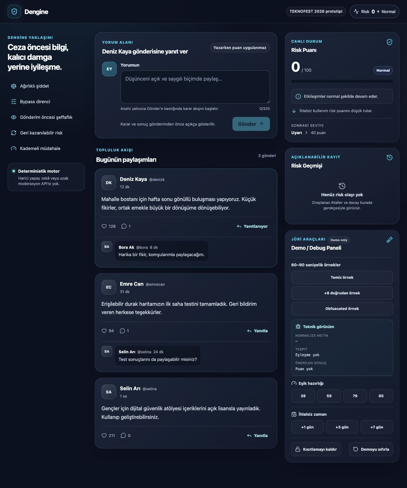
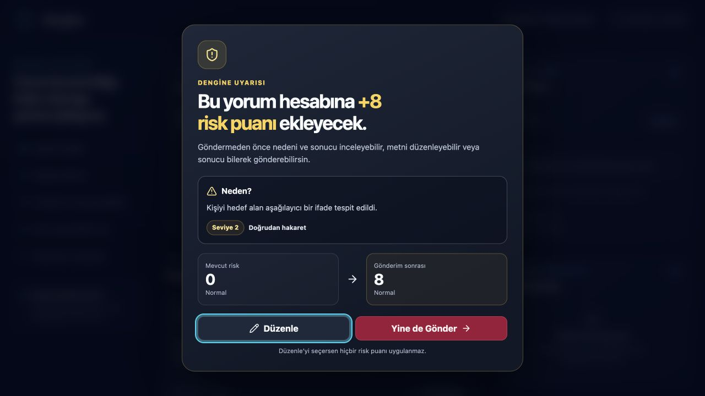
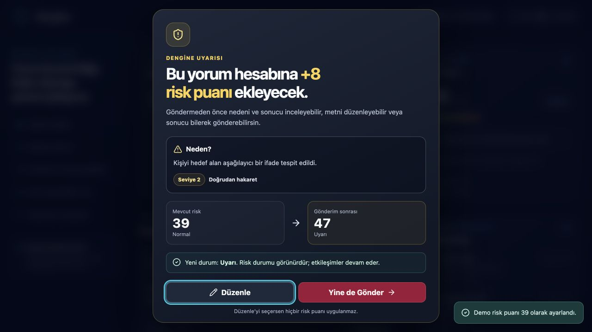

# Dengine

> Şeffaf, ilerlemeli ve geri kazanılabilir moderasyon için 2026 TEKNOFEST NSosyal İnovasyon Yarışması prototipi.

Dengine, sosyal platform moderasyonunu yalnızca gönderim sonrası cezadan çıkarıp **gönderim öncesi bilinçli seçime** taşıyan bir kullanıcı etkileşimi modelidir. Kullanıcı, risk doğuracak bir yorumu yayınlamadan önce nedenini, puanını, yeni durumunu ve varsa eşik sonucunu görür; metni düzenleyebilir veya sonucu bilerek gönderebilir.

Dengine bir yapay zekâ moderasyon ürünü değildir. Prototip; merkezi Türkçe sözlük, deterministik normalizasyon, sınır korumalı ifade tespiti, yapılandırılabilir ağırlıklar, dinamik risk ve decay kullanır. Harici LLM, makine öğrenmesi modeli veya uzak moderasyon API’si çağrılmaz.

## Problem

Geleneksel sosyal medya moderasyonu kullanıcı açısından ikili ve opak hissedebilir: içerik yayınlandıktan sonra kaldırılır, hesap uyarılır veya kısıtlanır; kullanıcı ihlalin nedenini ve sonucunu önceden bilmeyebilir. Ayrıca geçmiş ihlaller kalıcı bir damga gibi algılanabilir.

## Çözüm

Dengine aşağıdaki özellikleri tek bir etkileşim modelinde birleştirir:

- Şiddet seviyesine göre ağırlıklı ceza
- Noktalama, boşluk, tekrar ve yaygın karakter ikamelerine karşı deterministik normalizasyon
- Gönderimden önce açık risk ve sonuç önizlemesi
- **Düzenle** seçeneğinde sıfır ceza; **Yine de Gönder** seçeneğinde yayın sonrası ceza
- 0–100 dinamik risk puanı
- İhlalsiz günlerde üstel risk decay
- Normal → Uyarı → Bekleme Süresi → Geçici Yorum Kısıtlaması → Geçici Etkileşim Kısıtlaması
- Gerekçeli, puan değişimini gösteren risk geçmişi
- 60–90 saniyelik jüri demosu için güvenilir kontrol paneli

## Ekran Görüntüleri

### Ana akış



### Gönderim öncesi şeffaflık uyarısı



### Eşik geçişi



## Teknoloji

- React 19
- Vite 7
- TypeScript 5.9
- Düz, token tabanlı responsive CSS
- Vitest
- Browser `localStorage` prototip kalıcılığı
- Node/TypeScript adversarial değerlendirme betiği

Backend, veritabanı, ücretli servis veya harici yapay zekâ bağımlılığı yoktur.

## Mimari Özeti

```text
Yorum Girdisi
    ↓
Türkçe-aware Normalizasyon + İkame Hazırlığı
    ↓
Sınır Korumalı Ağırlıklı Sözlük Tespiti
    ↓
Ceza Önerisi (henüz uygulanmaz)
    ↓
Şeffaflık Katmanı
    ├── Düzenle → yayın yok, ceza yok
    └── Yine de Gönder
            ↓
        Risk Motoru
            ↓
        Müdahale Politikası
            ↓
        Güncel UI + Yapılandırılmış Geçmiş
```

Ayrıntılar için [ARCHITECTURE.md](ARCHITECTURE.md) dosyasına bakın.

## Kurulum

Gereksinim: Node.js `>=20.19.0` ve npm.

```bash
git clone https://github.com/egeduran11/dengine.git
cd dengine
npm install
npm run dev
```

Vite geliştirme adresini terminalde gösterir; varsayılan adres genellikle `http://localhost:5173` olur.

## Production Build

```bash
npm run build
npm run preview
```

Build çıktısı `dist/` altında oluşur.

## Test ve Doğrulama

```bash
npm run lint
npm run typecheck
npm test
npm run evaluation
npm run build
```

Tüm kalite kapısını tek komutla çalıştırmak için:

```bash
npm run verify
```

Gerçek son sonuçlar:

- 8 test dosyası, 65/65 test geçti
- Lint geçti, 0 uyarı
- TypeScript kontrolü geçti
- Production build geçti
- 130 adversarial vakada doğrudan tespit %90, obfuscated tespit %90
- 1/50 false positive (%2)

Kaynaklar: [TEST_RESULTS.md](TEST_RESULTS.md), [evaluation/results.json](evaluation/results.json), [evaluation/summary.md](evaluation/summary.md).

## 60–90 Saniyelik Demo

1. **Demoyu sıfırla** ile Risk Puanı 0’a dönün.
2. **Temiz örnek** düğmesine, ardından **Gönder**’e basın. Yorum yayınlanır; uyarı çıkmaz ve puan 0 kalır.
3. **+8 doğrudan örnek** düğmesine ve **Gönder**’e basın. `+8 risk puanı` uyarısını gösterin.
4. **Düzenle**’yi seçin. Puanın değişmediğini gösterin.
5. Aynı yorumu yeniden gönderip **Yine de Gönder**’i seçin. Yorumun yayınlandığını, puanın arttığını ve geçmiş kaydını gösterin.
6. **Obfuscated örnek** ile noktalama arasına saklanmış ifadenin yine yakalandığını gösterin.
7. **39** eşik hazırlığına basın, +8 örneğini gönderin ve `Normal → Uyarı` geçiş önizlemesini gösterin.
8. **+1 gün** ile decay uygulayın; puan düşüşünü ve geçmişteki eksi kaydı gösterin.

## Demo Kontrolleri

- Temiz, +8 doğrudan ve obfuscated hazır metinler
- Risk puanını 39, 59, 79 veya 85’e hazırlama
- 1, 3 veya 7 ihlalsiz gün simülasyonu
- Normalize metin, kanonik eşleşme, seviye ve önerilen puan görünümü
- Geçici kısıtlamayı demo için kaldırma
- Tüm demo verisini sıfırlama

## Kalıcılık

Prototip durumu tarayıcının `localStorage` alanında tutulur. Sayfa tekrar açıldığında tam geçmiş ve yorumlar geri yüklenir; son decay tabanından geçen tam ihlalsiz günler uygulanır. Üretimde bu yaklaşım yerine kimlik doğrulamalı sunucu kalıcılığı, veri saklama süresi, kullanıcı erişimi/itirazı ve denetim politikası gerekir.

## Erişilebilirlik

- Semantik başlıklar, form etiketi, `progress`, `time`, `dialog` ve canlı durum bölgeleri
- Görünür klavye odağı
- Dialog açılış odağı, Tab/Shift+Tab odak döngüsü, Escape ile güvenli düzenleme yolu ve kapanışta odağın yorum alanına dönüşü
- Durumu yalnız renkle aktarmayan metin etiketleri ve ikonlar
- En az 44px ana dokunma hedefleri
- `prefers-reduced-motion` desteği
- 375px mobil görünümde yatay taşma olmadan responsive düzen

## Sınırlamalar

Prototip sözlüğü küçük ve politikanın puanları bilimsel olarak doğrulanmış değildir. Bağlam, alıntı, ironi, geri kazanılmış argo, Türkçe ekler ve daha ileri Unicode homograph saldırıları tam çözülmez. Üretim kullanımı için insan incelemesi, itiraz, gizlilik ve kapsamlı dil/topluluk doğrulaması gerekir. Ayrıntılar: [LIMITATIONS.md](LIMITATIONS.md).

## Yarışma Konumlandırması

Ana konumlandırma: **Kullanıcı Katılımı ve Arayüz / Kullanıcı Deneyimi**.

Yenilik iddiası “küfür filtresini icat etmek” değildir. Dengine’ın özgün katkı önerisi, ağırlıklı deterministik tespiti gönderim öncesi sonuç önizlemesi, kullanıcı seçimi, kademeli müdahale, geri kazanılabilir risk ve açıklanabilir geçmişle tek bir etkileşim modelinde birleştirmesidir:

> Geriye dönük ceza → eylem öncesi bilinçli seçim  
> Kalıcı ihlal geçmişi → geri kazanılabilir dinamik risk

## Önemli Dosyalar

- [ARCHITECTURE.md](ARCHITECTURE.md)
- [EVALUATION.md](EVALUATION.md)
- [LIMITATIONS.md](LIMITATIONS.md)
- [TEST_RESULTS.md](TEST_RESULTS.md)
- [TECHNICAL_REPORT_INPUT.md](TECHNICAL_REPORT_INPUT.md)
- [FINAL_STATUS.md](FINAL_STATUS.md)
- [src/config/lexicon.ts](src/config/lexicon.ts)
- [src/config/policy.ts](src/config/policy.ts)
- [evaluation/results.json](evaluation/results.json)

## Dağıtım

Bu teslimde hosted demo oluşturulmadı. Öncelik; doğrulanmış source, tekrar üretilebilir local build, testler, değerlendirme çıktıları ve private GitHub deposudur. Uygulama statik Vite build’i olduğu için ücretsiz statik hosting’e daha sonra taşınabilir.
